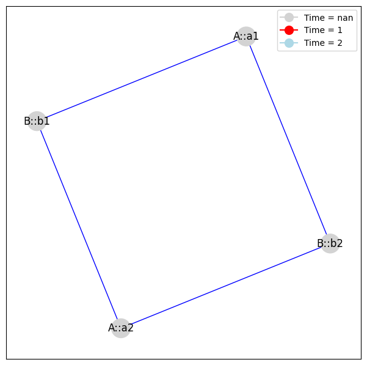

Basics
======

This notebook will give an overview of some of the basic functions in
relastat.

.. code:: ipython3

    import relastat as rs
    import pandas as pd
    import numpy as np

We will use a simple toy dataset which is created below.Thi can be
thought of as a graph with nodes ``a1``, ``a2``, ``b1`` and ``b2``, in
two time points ``1`` and ``2``.

.. code:: ipython3

    df = pd.DataFrame(
        {'A': ['a1', 'a1', 'a2', 'a2', 'a1', 'a1', 'a2', 'a2'],
            'B': ['b1', 'b2', 'b1', 'b2', 'b1', 'b2', 'b1', 'b2'],
            'ID': [1, 1, 1, 1, 2, 2, 2, 2]})
    print(df)

.. parsed-literal::

        A   B  ID
    0  a1  b1   1
    1  a1  b2   1
    2  a2  b1   1
    3  a2  b2   1
    4  a1  b1   2
    5  a1  b2   2
    6  a2  b1   2
    7  a2  b2   2

In the function ``rs.matrix_from_tables()``, we define which columns we
want relationships between and whether there is a time column (if so,
which column that is). The function can also take in a list of
dataframes.

.. code:: ipython3

    relationships = ['A', 'B']
    time_col = 'ID'
    
    A, attributes = rs.matrix_from_tables(
        df, relationships, dynamic_col=None, join_token='::')

.. parsed-literal::

    ['A', 'B']

Next shows how to find connected components of the matrix which contain
the most elements from the specified partition.

.. code:: ipython3

    c0, att0 = rs.find_cc_containing_most(A, attributes, partition='B', dynamic=False)
    c1, att1 = rs.find_cc_containing_most(
        A, attributes, partition='A', dynamic=True)

.. parsed-literal::

    Number of connected components: 2
    Number of connected components: 2

We can convert a matrix and attribute matrix into a networkx object.

.. code:: ipython3

    G = rs.to_networkx(A, attributes)

Extracting node attributes for labels and colours to plot.

.. code:: ipython3

    node_times = [G.nodes(data=True)[node]['time'] for node in G.nodes()]
    node_labels = {node: G.nodes(data=True)[node]['name'] for node in G.nodes()}
    
    time_colours = {np.nan: 'lightgrey', 1: 'red', 2.: 'lightblue'}
    node_colors = [time_colours[node_color] for node_color in node_times]

Plot the networkx graph.

.. code:: ipython3

    ## plot the netowrkx graph G    
    import matplotlib.pyplot as plt 
    import networkx as nx
    from matplotlib.lines import Line2D
    
    plt.figure(figsize=(7.5,7.5)) 
    pos = nx.spring_layout(G)   
    
    # Drawing nodes with colors based on time and labels based on name
    nodes = nx.draw_networkx_nodes(G, pos, node_color=node_colors, node_size=500)
    nx.draw_networkx_labels(G, pos, labels=node_labels)
    nx.draw_networkx_edges(G, pos, edgelist=G.edges(), edge_color='b', arrows=True)
    
    
    legend_elements = [Line2D([0], [0], marker='o', color='lightgrey', label='Time = nan',
                              markerfacecolor='lightgrey', markersize=10),
                       Line2D([0], [0], marker='o', color='red', label='Time = 1',
                              markerfacecolor='red', markersize=10),
                       Line2D([0], [0], marker='o', color='lightblue', label='Time = 2',
                              markerfacecolor='lightblue', markersize=10)]
    plt.legend(handles=legend_elements, loc='upper right')
    
    
    plt.show()

